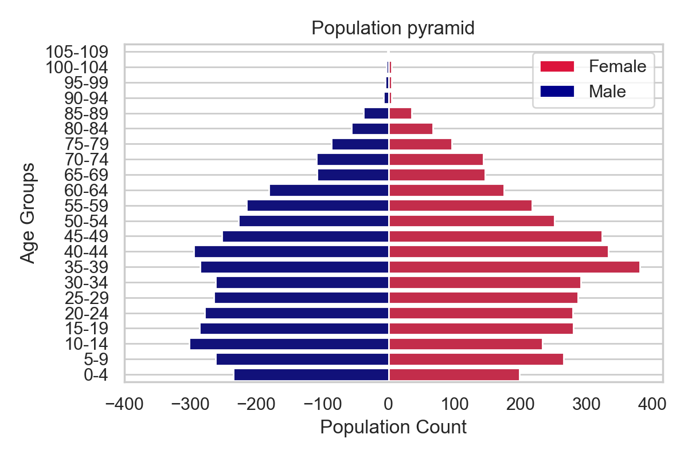

# Census Analysis

> Population analysis that reviews population demographic analysis, occupational and religious trends, predicted growth rate, and housing density which can help governments and organizations gain valuable insights into population trends, informing policy decisions and improve overall quality of life.

---

### Table of Contents

- [Description](#description)
- [References](#references)
- [License](#license)
- [Author Info](#author-info)

---

## Description
A population analysis task using Python and Jupyter Notebook involves analyzing the distribution of age within a particular region. First, the data would be collected and cleaned, ensuring that there are no missing or inaccurate values. Then, descriptive statistics like mean, median, and mode could be calculated using Pandas. Finally, Matplotlib and Seaborn could be used to create a histogram or box plot to visualize the distribution of ages in the region.

A population analysis task using Python and Jupyter Notebook may involve several steps, including data collection, cleaning, analysis, and visualization. Here's an overview of each step carried out in the task:

Data Collection: The first step is to gather customer data from various sources, such as customer databases, social media platforms, and website analytics tools.

Data Cleaning: Once the data is collected, it needs to be cleaned to remove any duplicates, inconsistencies, or errors. This can be done using Python libraries like Pandas, which can help with data cleaning and preprocessing.

Data Transformation: After cleaning the data, it may be necessary to transform it into a format that is suitable for analysis. For instance, data may need to be converted to numeric or categorical values or standardized in a specific format.

Data Analysis: Next, customer data will be analyzed using Python libraries like Numpy, Scikit-Learn, and Scipy to gain insights into customer behavior, preferences, and trends. Analysis could include clustering analysis, regression analysis, or machine learning algorithms to identify patterns in the data.

Data Visualization: Finally, Python can be used to create visualizations that make it easier to understand and communicate the insights gained from the analysis. This can be done using libraries like Matplotlib and Seaborn to create graphs, charts, and other visualizations.

Overall, a population analysis task using Python and Jupyter Notebook can help governments and organizations gain valuable insights into population trends, which can inform policy decisions and improve overall quality of life.

#### Technologies

- Python
- Jupyter Notebook
- Excel
- Matplotlib
- Seaborn

[Back To The Top](#customer-data-processing-project)

---

## References

- LinkedIn - [Mary-Ann Egbudom](https://www.linkedin.com/in/mary-ann-egbudom-9017b3109)
- Twitter - [@Rianne_egb](https://twitter.com/Rianne_egb)

[Back To The Top](#customer-data-processing-project)

---

## License

MIT License

Copyright (c) [2022] [Mary-Ann Egbudom]

Permission is hereby granted, free of charge, to any person obtaining a copy
of this software and associated documentation files (the "Software"), to deal
in the Software without restriction, including without limitation the rights
to use, copy, modify, merge, publish, distribute, sublicense, and/or sell
copies of the Software, and to permit persons to whom the Software is
furnished to do so, subject to the following conditions:

The above copyright notice and this permission notice shall be included in all
copies or substantial portions of the Software.

THE SOFTWARE IS PROVIDED "AS IS", WITHOUT WARRANTY OF ANY KIND, EXPRESS OR
IMPLIED, INCLUDING BUT NOT LIMITED TO THE WARRANTIES OF MERCHANTABILITY,
FITNESS FOR A PARTICULAR PURPOSE AND NONINFRINGEMENT. IN NO EVENT SHALL THE
AUTHORS OR COPYRIGHT HOLDERS BE LIABLE FOR ANY CLAIM, DAMAGES OR OTHER
LIABILITY, WHETHER IN AN ACTION OF CONTRACT, TORT OR OTHERWISE, ARISING FROM,
OUT OF OR IN CONNECTION WITH THE SOFTWARE OR THE USE OR OTHER DEALINGS IN THE
SOFTWARE.

[Back To The Top](#customer-data-processing-project)

---

## Author Info

- LinkedIn - [Mary-Ann Egbudom](https://www.linkedin.com/in/mary-ann-egbudom-9017b3109)
- Twitter - [@Rianne_egb](https://twitter.com/Rianne_egb)

[Back To The Top](#customer-data-processing-project)

